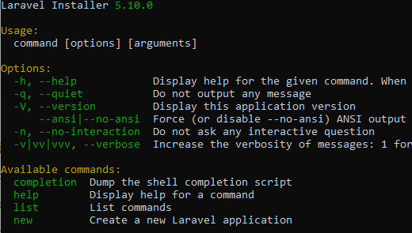
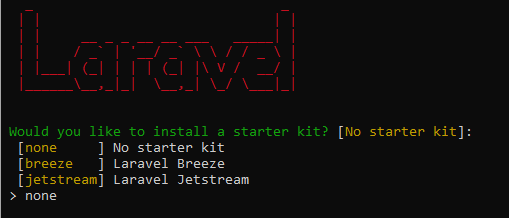

# Installation de laravel

### Installer l'outil de ligne de commande 'laravel/installer'
Ouvrez un terminal et tapez la commande suivante :
```bash
composer global require laravel/installer
```
La commande ci-dessus est utilisée pour installer l'outil d'installation de Laravel de manière globale sur votre système via Composer.

* **Explication :**
 1. `composer` : C'est un gestionnaire de dépendances pour PHP, utilisé pour installer et gérer les bibliothèques et les outils PHP.
 2. `global` : Indique que le paquet sera installé globalement sur votre système et non dans un projet spécifique. Cela signifie que vous pouvez accéder à l'outil depuis n'importe quel répertoire.
 3. `require` : Cette commande demande à Composer d'installer le paquet spécifié.
 4. `laravel/installer` : C'est le paquet officiel de Laravel qui vous permet de créer de nouveaux projets Laravel facilement en utilisant la commande `laravel new`.   
---
Pour pouvoir se servir de ce programme, on doit ajouter le chemin de l'exécutable de ce programme à notre $PATH.

1. Sous linux
 
Il est courant de modifier le fichier `.profile`.

On ouvre le fichier :

```bash
vim .profile
```
On appuie sur la touche i pour mettre vim en mode écriture, et on ajoute les lignes suivantes :
```vim
PATH="$HOME/.composer/vendor/bin:$PATH"
```
Ensuite la séquence de touches suivante pour enregistrer la modification et quitter vim `esc :wq`

Une dernière commande pour que le système prenne en compte la modification : `source .profile`.

2. Sur Windows 
* Localiser le répertoire global de Composer
  
Ouvrez l'invite de commande (CMD) ou PowerShell et tapez :

```bash
composer global config --list
```
Recherchez la ligne commençant par [home] ou [bin-dir], elle indiquera le chemin où Composer installe ses paquets globaux, généralement quelque chose comme :

```plaintext
C:\Users\<VotreNomUtilisateur>\AppData\Roaming\Composer\vendor\bin
```

* Ajouter ce chemin aux variables d'environnement en modifiant la variable `Path`
---
⚠️ **Remarque importante :**

Si Composer a été installé dans un autre répertoire, le chemin peut différer. Assurez-vous d'utiliser le chemin correct affiché lors de l'exécution de la commande `composer global config --list`.
---

À partir de là, on peut taper la commande `laravel` et on obtient ce résultat :



On est prêt à créer une application laravel :

```bash
laravel new blog
```
1. **Choix du kit à utiliser pour la gestion de l'authentification :** 

On va commencer sans l'utilisation d'un kit en particulier 

 

2. **Choix d'un framework pour les tests**
La question **"Testing framework do you prefer?"** (Quel framework de test préférez-vous ?) qui vous demande de choisir entre Pest et PHPUnit lors de la création d'un projet Laravel fait référence à l'outil que vous souhaitez utiliser pour tester votre application.

 * **PHPUnit** : C'est le framework de test par défaut pour PHP et Laravel. Il permet d'écrire des tests unitaires et fonctionnels avec une syntaxe traditionnelle. Il est largement utilisé et bien supporté.

 * **Pest** : C'est un framework de test moderne basé sur PHPUnit. Il offre une syntaxe plus simple et lisible, idéale pour ceux qui préfèrent des tests plus concis et une approche plus fluide (style "BDD"). Pest utilise PHPUnit en arrière-plan.

On choisira l'option par défaut en tapant sur la touche entrée. Nous n'aurons pas de tests à effectuer d'ailleurs.

3. **Choix du type de base de données à utiliser pour l'application**
La question "Which database will your application use?" (Quelle base de données votre application utilisera-t-elle ?) vous demande de choisir le type de base de données que vous souhaitez utiliser avec votre application Laravel.

Laravel supporte plusieurs systèmes de gestion de bases de données (SGBD), et cette question vous permet de spécifier lequel vous souhaitez configurer.

Dans notre cas, nous choisirons **MySQL**.

4. Lancer l'exécution des migrations de base de données par défaut

La question **"Default database updated. Would you like to run the default database migrations?"** (Base de données par défaut mise à jour. Souhaitez-vous exécuter les migrations de base de données par défaut ?) vous demande si vous voulez exécuter les **migrations** après avoir configuré la base de données.

Les **migrations** dans Laravel sont des fichiers qui définissent la structure de la base de données, comme la création des tables et des colonnes. Lorsque vous répondez oui, Laravel va exécuter ces migrations pour créer automatiquement les tables de base nécessaires à votre application (comme la table `users` pour l'authentification, par exemple).

Si vous répondez **non**, les migrations ne seront pas exécutées immédiatement, et vous pourrez les lancer manuellement plus tard avec la commande `php artisan migrate` lorsque vous serez prêt.

On choisira `oui` comme option. Si la base de données n'est pas disponible, Laravel se proposera de le faire pour nous. vu que si gentiment demandé, on ne va pas se faire prier dans ce cas 😎😎😎.


Une fois cette commande exécutée et les configurations de base faites, on entre dans le dossier blog :

```bash
cd blog
``` 
Et on tape la commande suivante pour démarrer le serveur laravel à l'adresse http://127.0.0.1:8000 par défaut.

```bash
php artisan serve
``` 
Ouvrez le navigateur et aller a l'URL suivante : [blog](http://127.0.0.1:8000)  

Si vous souhaitez un autre port que le 8000, une option existe, un exemple pour le port 5000 :

```bash
php artisan serve --port 5000
```
