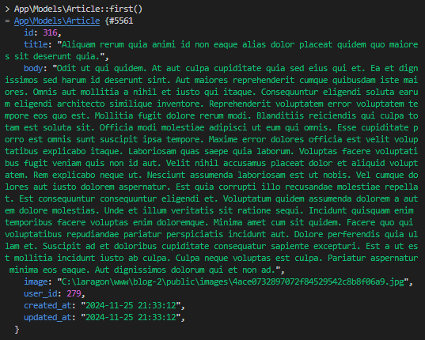

# Les Modèles
Pour comprendre les modèles, il est nécessaire de comprendre ce qu'est un ORM (Object Relational Mapper).
Un ORM est une technique consistant à interagir avec la BDD en utilisant un langage de programmation plutôt que le SQL.
Laravel est fourni avec un ORM qui s'appelle `Eloquent` et qui permet de simplifier considérablement l'écriture des requêtes les plus courantes.  
Eloquent fournit une interface avec les tables en créant un modèle correspondant qui est utilisé pour intéragir avec la table.
Les Modèles permettent d'exécuter des requêtes sur nos tables, ainsi qu'à insérer des nouvelles données, mais aussi d'effectuer toutes sorte d'opérations.  
Toutes les intéractions avec la table se feront à travers le modèle.  
Les modèles sont en quelque sorte le 'blueprint' des resources que nous aurons en base de données.
Voici une réponse stack-overflow sur les  [ORM](https://stackoverflow.com/questions/1279613/what-is-an-orm-how-does-it-work-and-how-should-i-use-one#1279678) et l'article [wikipedia](https://en.wikipedia.org/wiki/Object-relational_mapping)

Pour notre application, ll nous faut un modèle par tables. Nous avons déjà un modèle `User` qui vient par défaut avec une application laravel, ajoutons un modèle `Article` et un modèle `Comment`.
```bash
php artisan make:model Article;
php artisan make:model Comment
```
Les modèles ont été créés directement dans le dossier `app/Model` par défaut grâce ou à cause de l'insistance de la communauté. Jusqu'à laravel 8, les modèles étaient dans le dossier `app/` par défaut.

Nous avons déjà modifié le modèle `User`, modifions à présent `Article` et `Comment`.  
Pour commencer, nous allons ajouter simplement du code qui nous permettra d'enregistrer des données dans la BDD, ensuite nous verrons les relations `Eloquent` simples.

On ajoute la propriété `$fillable`, qui spécifiera au framework de nous laisser insérer des valeurs dans les champs correspondant. Ces champs correspondent à nos champs de BDD, attention donc à ne pas faire d'erreur en les écrivant.
```php
class Article extends Model
{
    // Ajout
    protected $fillable = ['title', 'body', 'user_id', 'image'];
}
```
```php
class Comment extends Model
{
    protected $fillable = ['comment', 'user_id', 'article_id'];
}
```
On est fin prêt à insérer des données. Reprenons nos fichiers `ArticleFactory` et `CommentFactory`.
On avait codé certains champs en 'dur', rendons les dynamiques.
Nous allons créer des utilisateurs avec des articles et des commentaires associés. Voici les `factories` modifiées :
Ne vous contentez pas de copier-coller, **lisez-les**.  
`ArticlesFactory` 
```php
<?php

namespace Database\Factories;

use App\Models\Article;
use App\Models\User;
use Illuminate\Database\Eloquent\Factories\Factory;

class ArticleFactory extends Factory
{
    /**
     * The name of the factory's corresponding model.
     *
     * @var string
     */
    protected $model = Article::class;

    /**
     * Define the model's default state.
     *
     * @return array
     */
    public function definition()
    {
        return [
            'title' => fake()->text(15),
            'body' => fake()->text(200),
            'user_id' => function () {
                return User::inRandomOrder()->first()->id;
            },
            'image' => fake()->image('public/images'), //Prenez la peine de créer un dossier 'images' dans 'public'
        ];
    }
}
```
`CommentsFactory`
```php
<?php

namespace Database\Factories;

use App\Models\Article;
use App\Models\User;
use App\Models\Comment;
use Illuminate\Database\Eloquent\Factories\Factory;

class CommentFactory extends Factory
{
    /**
     * The name of the factory's corresponding model.
     *
     * @var string
     */
    protected $model = Comment::class;

    /**
     * Define the model's default state.
     *
     * @return array
     */
    public function definition()
    {
        return [
            'comment' => fake()->text(50),
            'user_id' => function () {
                return User::inRandomOrder()->first()->id;
            },
            'article_id' => function () {
                return Article::inRandomOrder()->first()->id;
            },
        ];
    }
}
```
Nous avons modifié ces fichiers pour pouvoir utiliser les modèles que nous avons créé, les fonctions qui assignent les `ID` iront chercher des resources existantes en BDD et les assigneront automatiquement selon nos spécifications.

#### Database Seeder
Le `seeder` est l'outil qui va nous permettre d'ajouter des données automatiquement.
Copiez ces lignes dans le fichier `seeders/DatabaseSeeder.php`
```php
public function run()
{
     User::factory(5)->create();
     Article::factory(10)->create();
     Comment::factory(10)->create();
}
```
Au début de ce fichier, n'oubliez pas d'inclure les modèles dont vous aurez besoin. 
Chaque fois qu'on exécutera ce code, on créera 5 utilisateurs, 10 articles et 10 commentaires.

Assurez-vous que chaque modèle utilise le trait `HasFactory` et que l'annotation PHPDoc `/** @use HasFactory<\Database\Factories\...Factory> */` est présente. Cela permet de générer facilement des données de test sans écrire manuellement chaque enregistrement, ce qui rend le processus de développement plus rapide et fiable.

On devrait avoir ceci pour chaque modèle concerné : 

```php
//ajout
use Illuminate\Database\Eloquent\Factories\HasFactory;

class Article extends Model
{
    //ajout
    /** 
     * @use HasFactory<\Database\Factories\ArticleFactory>
     */
    use HasFactory;
    
}

```

```php
//ajout
use Illuminate\Database\Eloquent\Factories\HasFactory;

class Comment extends Model
{
    //ajout
    /** 
     * @use HasFactory<\Database\Factories\CommentFactory> 
     */
    use HasFactory;
    
}
```


Enfin, la commande :

```bash
php artisan db:seed
```
Cette commande pourra prendre un peu de temps, la librairie `$faker` va télécharger des images.

### Mais au final, je n'ai eu aucune image 😢😢😢

Dans les versions précédentes de Laravel, la méthode `fake()->image('public/images')` était couramment utilisée pour générer des images de manière aléatoire lors de la création de données fictives dans les usines (`factories`). Cependant, cette méthode n'est plus disponible dans les versions récentes, notamment en raison de modifications dans la façon dont Faker et certaines bibliothèques liées aux images sont gérées.

**Nouvelle procédure pour la génération d'images avec Faker**
Afin de continuer à générer des images factices dans vos usines, il existe désormais une approche alternative. Dans cet exemple, nous utilisons la bibliothèque **Picsum** via un `ImageFaker` pour créer des images aléatoires.


**Installation**

```bash
composer require alirezasedghi/laravel-image-faker
```

Voir plus : [Laravel Image Fake](https://github.com/AlirezaSedghi/laravel-image-faker)

Nous aurons donc : 

```php 
<?php

namespace Database\Factories;

use Alirezasedghi\LaravelImageFaker\ImageFaker;
use Alirezasedghi\LaravelImageFaker\Services\Picsum;
use App\Models\Article;
use App\Models\User;
use Illuminate\Database\Eloquent\Factories\Factory;


/**
 * @extends \Illuminate\Database\Eloquent\Factories\Factory<\App\Models\Model>
 */
class ArticleFactory extends Factory
{
    /**
     * The name of the factory's corresponding model.
     *
     * @var string
     */
    protected $model = Article::class;

    
    /**
     * Define the model's default state.
     *
     * @return array<string, mixed>
     */
    public function definition(): array
    {
        $imageFaker = new ImageFaker(new Picsum());
        
        return [
         
            'title' => fake()->sentence(15), // on veut 15 mots
            'body' => fake()->paragraph(50), // on veut 50 phrases
            'user_id' => function () {
                return User::inRandomOrder()->first()->id;
            },
            'image' => $imageFaker->image(public_path("images")) 
           
        ];
    }
}

```

Notre BDD est prête maintenant fin prête, avec des images disponibles !

Vérifions tous ça
```bash
php artisan tinker
```
```bash
App\Models\Article::first();
```
Vous devriez avoir un résultat semblable à ce qui suit :


